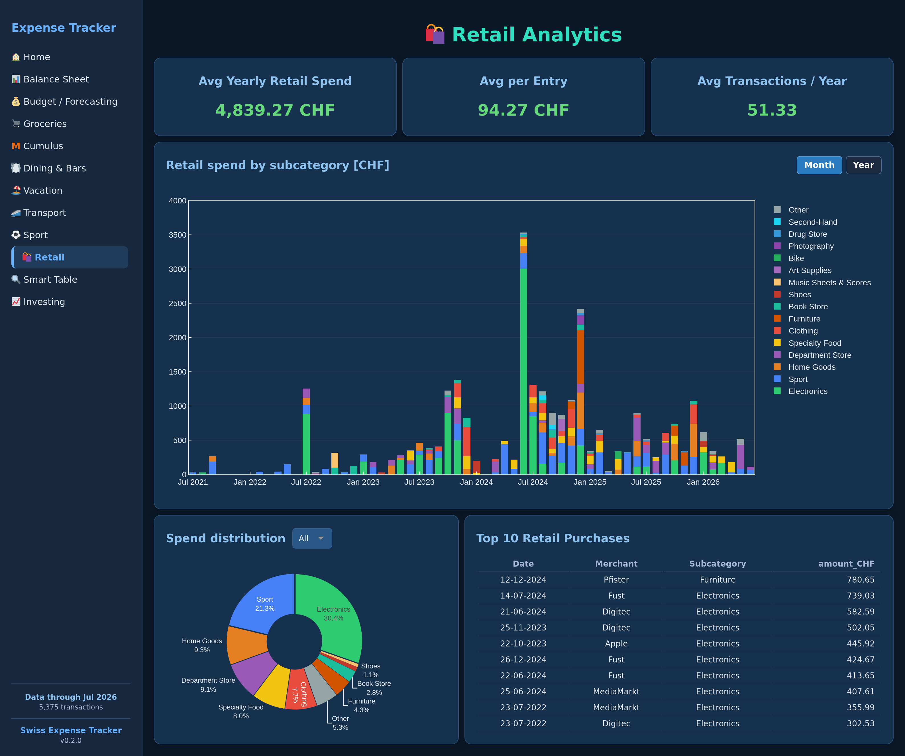

<h1 align="center">☀️ Hi there, I'm Sebastian! ☀️</h1>

<h3 align="center">Data Scientist & AI Engineer</h3>

Turning messy data into clear insights and building AI-powered tools that make everyday life smarter 🤖📊
 
Based in Switzerland 🇨🇭 · Python at heart 🐍 · Sports enthusiast 🚴‍♂️🎾⛳

---

## 🙋‍♂️ About Me

I'm a Data Scientist based in Switzerland with a passion for turning messy data into clear insights. I love combining technical problem-solving with the things that get me excited outside of work — whether that's analyzing a tennis match, tracking cycling performance, or building tools that make everyday life a little smarter.

- 🏗️ Currently building **SwissExpenseTracker** — a personal finance app tailored to life in Switzerland
- 🌍 Learning **Spanish** on the side *(¡poco a poco!)*
- 🤝 Always open to collaborating on **Python projects** — especially data, analytics, or automation

---

## 🔧 Tools & Technologies

### Main skills

### Data, ML & AI focus

---

## 🚀 Current Projects

  

  

---

## 📊 GitHub Stats

---

*Feel free to connect, collaborate, or just say hi!* 👋

